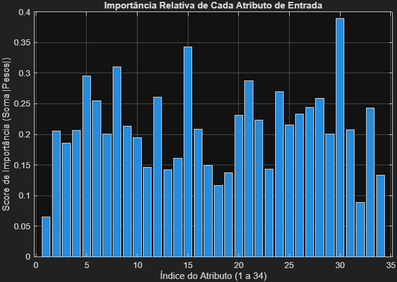

# Atividade 5 - Perceptron Simples
Autor: Weslem Rodrigues e Silva

## Questão1:
```bash
Matriz de Confusão Final (soma das rodadas):
        1090           0           0           0           0           0          13
          13         526           0          27           1           1          44
           7          12         686           0           0           0           0
           0          87           1         382           0           0          31
           4           7           2          10         441           0          15
           0           2           0           2           3         189           4

Acurácia Global: 92.06%
Precisão Média: 94.95%
Total de Acertos: 3314 de 3600 amostras de validação.

Elapsed time is 0.095722 seconds.
```

## 2.1:
```bash
Matriz de Confusão Final (soma das rodadas):
        1037          20           2          23           3           0          47
          42         344           0          32          76           0         104
           8           1         677           2           0           0          21
          61          49           1         291          16           0          54
           8         137           0          47         204           5          79
          10           2           0           0          15         169          13

Acurácia Global: 75.61%
Precisão Média: 81.08%
Total de Acertos: 2722 de 3600 amostras de validação.

Elapsed time is 15.015314 seconds.
```

## 2.2:
```bash
Matriz de Confusão Final (soma das rodadas):
        1088           0           0           1           0           0          21
           7         475           1          84           2           3          56
           3           4         684           0           0           0           0
           0         150           1         258           0           0          75
           2           9           1          21         444           0          11
           2           3           0           5           2         176          11

Acurácia Global: 86.81%
Precisão Média: 89.96%
Total de Acertos: 3125 de 3600 amostras de validação.

Elapsed time is 0.094445 seconds.
```

##2.3:
```bash
Análise de Sensibilidade: Top 10 Atributos Mais Importantes
1º: Atributo #30 (Score de Importância: 0.3894)
2º: Atributo #15 (Score de Importância: 0.3430)
3º: Atributo #8 (Score de Importância: 0.3104)
4º: Atributo #5 (Score de Importância: 0.2958)
5º: Atributo #21 (Score de Importância: 0.2874)
6º: Atributo #24 (Score de Importância: 0.2694)
7º: Atributo #12 (Score de Importância: 0.2608)
8º: Atributo #28 (Score de Importância: 0.2587)
9º: Atributo #6 (Score de Importância: 0.2546)
10º: Atributo #27 (Score de Importância: 0.2444)
```


